# DevOps Bootcamp - by Asad Hanif

-------
**Repo Outline**
- [Welcome to the DevOps Bootcamp](#welcome-to-the-devops-bootcamp)
- [Meet the Instructor](#meet-the-instructor)
- [Aim of Bootcamp](#aim-of-bootcamp)
- [Learning Outcomes (LOs)](#learning-outcomes-los)
- [Taking the Bootcamp](#taking-the-bootcamp)
- [Syllabus](#syllabus)
- [Recorded Sessions](#recorded-sessions)

-------

## Welcome to the DevOps Bootcamp!

We are thrilled to welcome you to the **DevOps Bootcamp**! Congratulations on taking this important step towards advancing your skills and knowledge in the exciting field of DevOps. We are excited to have you on board.

During the Bootcamp, you will embark on a transformative learning journey where you'll gain hands-on experience with essential DevOps practices, tools, and methodologies. Our instructor is committed to providing you with a comprehensive and engaging training experience.

## Meet the Instructor 

🧑‍🏫 We are thrilled to introduce our instructor for the *DevOps Bootcamp*, **Asad Hanif**! With a wealth of experiance in the field of DevOps and a passion for teaching, Asad is dedicated to guiding you through an enriching learning journey.

📚 Asad brings an industry expertise, having worked extensively in the field of DevOps and cloud engineering. With his deep understanding of tools and technologies like Kubernetes, OpenShift, Docker, AWS, and more, he is well-equipped to provide valuable insights and practical guidance.

🧑‍🏫 Connect with Asad on LinkedIn and other social media platforms to gain access to get in touch. Follow the links below to connect with him:

- [LinkedIn Profile](https://www.linkedin.com/in/asadhanif3188/)
- [GitLab Profile](https://gitlab.com/asadhanif3188)
- [GitHub Profile](https://github.com/asadhanif3188)
- Please feel free to reach out at [asadhanif3188@gmail.com](asadhanif3188@gmail.com). 

**Note**: Information in the above image is as per the July 09, 2023. You may be watching it later on.

## Aim of Bootcamp 

The Bootcamp is a continuation of the efforts of the [OSFP](https://osfp.org.pk
):

> Initial aim is to train and make **10 thousand** Pakistanis as DevOps professionals, who can earn a **minimum of $1000** per month.

### Open-Source Foundation of Pakistan (OSFP)

- OSFP is a non-profit organization, founded in 2009.
- Aims at revolutionize Pakistani IT echo-system.
- By spreading awareness about Open-Source solutions.
- [OSFP Website](https://osfp.org.pk)
- [OSFP @ LinkedIn](https://www.linkedin.com/company/pakistan-open-source-foundation/)
- [OSFP @ Facebook](https://www.facebook.com/osfp.org.pk)

## Learning Outcomes (LOs)

Following are the learning outcomes of the DevOps Bootcammp:

📖 **LO 1**: Understand the basic concepts and principles of DevOps and implication to improve the development and deployment processes.

📖 **LO 2**: Demonstrate proficiency in utilizing a range of version control system tools to manage and track changes in software development projects.

📖 **LO 3**: Demonstrate proficiency in utilizing container runtime environments to containerized and deploy applications.
 
📖 **LO 4**: Demonstrate proficiency in leveraging container orchestration tools efficiently to manage and orchestrate applications.

📖 **LO 5**: Demonstrate proficiency in implementing CI/CD pipelines to automate the deployment process.

📖 **LO 6**: Demonstrate proficiency in effectively leveraging Infrastructure as Code (IaC) tools to automate and manage infrastructure resources.

📖 **LO 7**: Demonstrate proficiency in leveraging configuration management tools to efficiently manage and automate software configurations.

📖 **LO 8**: Demonstrate proficiency in utilizing monitoring tools to effectively monitor and analyze performance of applications.

## Taking the Bootcamp

### Important Details

Here are a few important details to help you prepare for the bootcamp:

1. **Bootcamp Schedule**: The bootcamp is scheduled to start on **Monday, June 19, 2023**, and will run for **7-8 months**. Sessions held at **09:00 pm - 10:00 pm** on *Mon-Fri (5 Days of the week)*. Please mark your calendar and ensure that you have allocated dedicated time to fully participate in the bootcamp sessions.

2. **Technical Setup Support**: If you encounter any technical issues or require assistance with the setup of the required software or tools, please don't hesitate to reach out to our support team at **asadhanif3188@gmail.com**. We are here to help you ensure a smooth technical setup before the bootcamp begins.

3. **Slack Communication Channel**: To facilitate seamless communication and collaboration during the bootcamp, we have set up a dedicated Slack workspace. Here's how you can join the Slack channel:
    - Slack Workspace Invitation: https://join.slack.com/t/devops-bootcamp-org/shared_invite/zt-1ytcp61he-7iz2ALtQRA1S8tnVxM0XHw
    - Slack Channel: Learning DevOps (within DevOps Bootcamp workspace)

4. **Live Zoom Session**: The bootcamp sessions are conducted through Zoom, a popular online meeting platform. Here are the details to join the Zoom meetings:
    - Meeting Date: **June 19, 2023**
    - Meeting Time: **09:00 pm - 10:00 pm**
    - Zoom Meeting Link: https://us05web.zoom.us/j/81725954250?pwd=Qmd4bVliMWN2RXBpd2hWMk01aURaUT09

### Self-paced Mode

- All the recorded session of the Bootcamp are freely available at [YouTube Channel](https://www.youtube.com/@solveit2k18), so that you can take the course at your own pace. 
- [DevOps Bootcamp Playlist](https://youtube.com/playlist?list=PLg6orTBNhcmcSPQA0rbs_p1dSvLkw4J2q)

<a href="https://youtube.com/playlist?list=PLg6orTBNhcmcSPQA0rbs_p1dSvLkw4J2q" target="_blank"> 
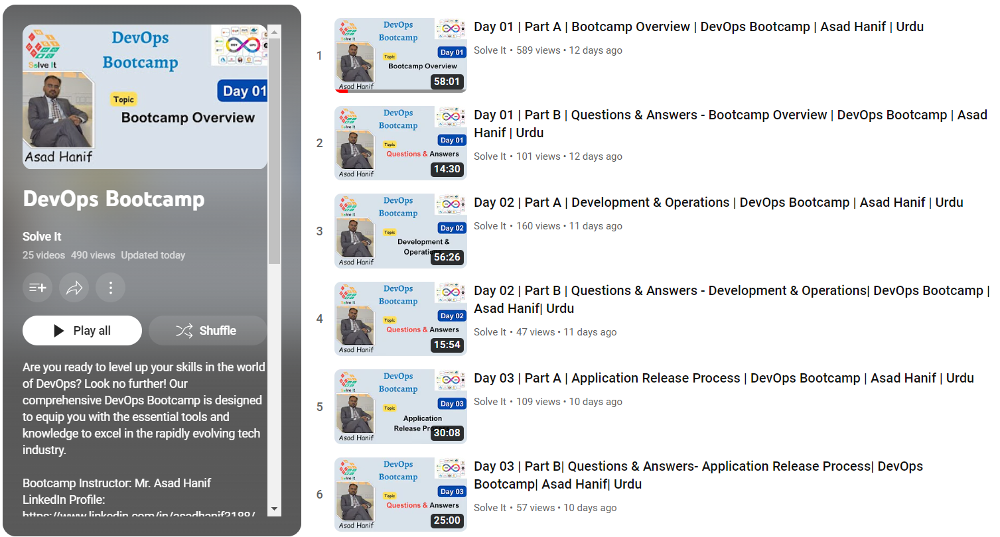 </a>

### Target Audience

The target audience may include:

- **Software Developers**: Those who want to understand how DevOps principles and practices can improve collaboration and accelerate software development.
- **Operations Engineers**: Professionals responsible for managing and maintaining IT infrastructure, who want to learn how DevOps can streamline operations and increase efficiency.
- **System Administrators**: Individuals interested in learning how to automate infrastructure provisioning and management using DevOps tools and practices.
- **Quality Assurance/Testers**: Those who want to explore how DevOps methodologies, such as continuous testing and integration, can improve software quality.
- **IT Managers**: Decision-makers who want to understand the benefits of DevOps and how to implement it within their organizations for improved productivity and delivery.
- **Tech Enthusiasts**: Individuals with a passion for technology who want to explore the DevOps field and its impact on software development and operations.

# Syllabus

## [Module 01: Introduction to DevOps](module-01) 
- Phases to SDLC 
- What is Development? 
    - Development Types
    - Role of Developer
- What are Operations? 
    - Role of operations 
- Common problems faced during 
    - Development 
    - Operations 
- How DevOps solved these problems? 
- Agile Process Model
- Lifecycle of DevOps 
- 7 C’s of DevOps 

[See Module 01 Videos](module-01)

## Module 02: Linux 
- Operating System 
    - Role of Operating System 
    - Types of Operating Systems
- Virtualization 
    - Virtualization Platforms 
    - Virtual Machines 
    - Setup a Linux Virtual Machine
- Linux File System
- Command Line Interface
- Basic Linux Commands
- Package Manager
- File Editors 
    - Working with Nano 
    - Working with Vi 
    - Working with Vim 
- Linux Accounts & Groups
- Users 
- Permissions 
- File Ownership & Permissions
- Pipes & Redirects commands 
- Networks commands 
- Types of Shells 
- Introduction to Shell Scripting
    - Basic shell script 
    - Decision making in shell script
    - Repetitive structure in shell script 
    - Functions in shell script 
- Environment Variables
- SSH - Secure Shell
- Secure Copy - SCP 
- VM Monitoring commands 

## Module 03: Version Control System (VCS)
- Introduction to VCS
- Types of CVSs
- Introduction to Git
- Installation of Git
- Setup Git Repository locally 
- Introduction to GitLab and GitHub 
- Setup Git Repository remotely 
    - On GitLab 
    - On GitHub 
- Connecting local and remote repositories 
- Concept of Branches
- Creating new branches 
- Deleting branches
- Switching to different branches
- Merging branches
- Merge Requests
- Rebase
- Resolving Merge Conflicts
- Gitignore
- Git stash
- Undoing Commits

## Module 04: Databases 
- Databases in development process
- Database Types

## Module 05: Containerization
- What is a Container?
- Container vs Image
- Docker vs. Virtual Machine
- Docker Architecture and components
- Main Docker Commands
- Debug Commands
- Docker Demo - Project Overview
- Dockerfile - Build your Docker Image
- Multi-stage Dockerfile 
- Docker Compose - Run multiple Docker containers
- Deploy docker application on a server
- Docker Volumes - Persisting Data
- Docker Network Model

## Module 06: Artifact Repository Manager
- Introduction to Artifact Repository Manager
- Docker Repository
    - Docker Hub 
    - Amazon Elastic Container Registry (ECR)
    - Nexus 
    - GitLab Registry
- Pushing Docker images on 
    - Docker Hub
    - GitLab Registry
    - ECR
- Introduction to Nexus
- Install Nexus on a cloud server
- Repository Types
- Publish Artifact to Repository
- Cleanup Policies and Scheduled Tasks
- Create Docker Hosted Repository on Nexus
- Deploy Nexus as Docker Container
- Pushing Docker images on Nexus 

## Module 07: Cloud Computing with AWS
- Introduction to Cloud Computing 
- Cloud Service Models 
    - IaaS
    - PaaS
    - SaaS
- Introduction to Cloud Platforms 
- Introduction to AWS Services 
- Regions & Availability Zones
- Introduction to EC2 Virtual Cloud Server
- Deploy Application on VM
- IAM - Manage Users, Roles and Permissions
- S3 Buckets 
- AWS CLI 
- VPC - Manage Private Network on AWS
- Elastic Load Balancer (ELB) 
- Amazon RDS 
- Route53
- Amazon Serverless 

## Module 08: Continuous Integration and Continuous Deployment (CI/CD)
- Introduction to CI/CD
- Introduction to CI/CD Tools
    - GitLab CI
    - Jenkins 
    - GitHub Actions 
- Core Concepts of GitLab CI/CD
- Jobs: Basic Building Blocks of Pipeline
- Stages: Group jobs
- needs: Dependency between jobs
- script: Inline shell commands and executing shell script
- only: Specify when job should run
- Workflow Rules: Control Pipeline behavior
- Trigger Pipeline on Merge Request
- Predefined CI/CD Variables in GitLab
- Define Custom Variables
- GitLab Architecture
- GitLab Runners for running the jobs
- GitLab Executors - Different Executor Types
- Job Execution Flow
- Docker Executor
- Specific Runners: Runner for specific project
- Configure self-managed Runners
- Install & Register an AWS EC2 Runner
- Execute jobs on specific Runner (Tags)
- Add Docker Runner on EC2 Instance
- Group Runners: Runner for a GitLab Group
- Build a real-life CI/CD Pipeline for Node.js Application
- Build Docker Image & Push to Private Registry
- GitLab Environments
    - Dev environment
    - Stagging environment
    - Productions environment
- Deploy app to different Environments 
    - Dev server
    - Stagging server 
    - Productions server 
- Deploy with Docker Compose
- Optimize CI/CD Pipeline & Configure Multi-Stage Pipeline
- Configure Dynamic Versioning for Docker Image
- Configure Caching to speed up Pipeline execution
- Testing in CI/CD & Configure Security Tests (SAST)
- Intro to Multi-Stage Deployments (Multi-Stage Demo)
- Promote to Staging (Multi-Stage Demo)
- Promote to Production (Multi-Stage Demo)
- Introduction to Jenkins 
- Install Jenkins
- Introduction to Jenkins UI
- Install Build Tools in Jenkins
- Jenkins Basics Demo - Freestyle Job
- Docker in Jenkins
- Freestyle to Pipeline Job
- Intro to Pipeline Job
- Jenkinsfile Syntax
- Create complete Pipeline
- Intro to Multibranch Pipeline
- Jenkins Jobs Overview
- Credentials in Jenkins
- Jenkins Shared Library
- Webhooks - Trigger Pipeline Jobs automatically
- Dynamically Increment Application version in Jenkins
- Deploy to EC2 server from Jenkins Pipeline

## Module 09: Container Orchestration with Kubernetes
- What is container orchestration? 
- Orchestration Tools 
- Docker Swarm 
- Kubernetes 
- OpenShift 
- Intro to Kubernetes
- Main Kubernetes Components
- Kubernetes Architecture
- Cluster Setup with Minikube 
- Kubectl commands 
- Cluster Setup with KubeAdm 
- YAML Configuration File
- Deploying Application in Kubernetes Cluster
- Namespaces - Organizing Components
- Services - Connecting to Applications inside cluster
- Ingress - Connecting to Applications outside cluster
- Volumes - Persisting Application Data
- ConfigMap & Secrets
- StatefulSet - Deploying Stateful Applications
- Managed Kubernetes Services
- Helm - Package Manager for Kubernetes
- Helm Charts Demo
- Developing Custom Helm Chart
- Deploying Images in Kubernetes from private Docker repository
- Kubernetes Operators for Managing Complex Applications
- Helm and Operator Demo
- Secure the cluster - Authorization with RBAC
- Microservices in Kubernetes
- Deploy Microservices Application
- Production & Security Best Practices
- Create Helm Chart for Microservices
- Deploy Microservices with Helmfile

## Module 10: CI/CD with Kubernetes
- CI/CD for Microservices based Application 
- What are Microservices?
- Monorepo vs. Polyrepo
- Build Microservices (Monorepo Demo)
- Deploy Microservices (Monorepo Demo)
- CI/CD pipeline for Polyrepo
- Extract common logic (Job Templates)
- CI Templates - Library for all projects (Job Templates)
- Deploy Microservices to Kubernetes cluster

## Module 11: Managed Container Services
- Container Service on DigitalOcean 
- Create DOKS cluster 
- Complete CI/CD Pipeline with DOKS and DockerHub 
- Container Services on AWS
- Create EKS cluster with AWS Management Console
- Configure Autoscaling in EKS cluster
- Create Fargate Profile for EKS Cluster
- Create EKS cluster with eksctl command line tool
- Deploy to EKS Cluster from Jenkins Pipeline
- Complete CI/CD Pipeline with EKS and DockerHub
- Complete CI/CD Pipeline with EKS and ECR

## Module 12: Terraform (IaC)
- Introduction to Infrastructure as a Code (IaC) 
- Introduction to Terraform
- Install Terraform & Setup Terraform Project
- Providers in Terraform
- Resources & Data Sources
- Change & Destroy Terraform Resources
- Terraform commands
- Terraform State
- Output Values
- Variables in Terraform
- Environment Variables in Terraform
- Create Git Repository for local Terraform Project
- Automate Provisioning EC2 with Terraform
- Provisioners in Terraform
- Modules in Terraform
- Automate Provisioning EKS cluster with Terraform
- Complete CI/CD with Terraform
- Remote State in Terraform

## Module 13: Ansible (Configuration Management)
- Introduction to Configuration Management 
- Introduction to Ansible
- Install Ansible 
- Setup Managed Server to Configure with Ansible 
- Ansible Inventory and Ansible ad-hoc commands 
- Configure AWS EC2 server with Ansible
- Managing Host Key Checking and SSH keys 
- Introduction to Playbooks 
- Ansible Modules 
- Collections in Ansible
- Deploy Nodejs application 
- Ansible Variables - make Playbook customizable
- Deploy Nexus 
- Ansible Configuration - Default Inventory File 
- Run Docker applications 
- Terraform & Ansible 
- Dynamic Inventory for EC2 Servers
- Deploying Application in K8s
- Run Ansible from Jenkins Pipeline 

## Module 14: Observability and Monitoring 
- Observability vs. Monitoring 
- Pilers of Observability
    - Logs 
    - Metrics 
    - Traces 
- Prometheus for Metrics Collection 
- Grafana for Visualization 
- Monitoring simple application with Prometheus and Grafana 
- Monitoring Microservices with Prometheus and Grafana
- Jaeger for distributed tracing 
- Kubecost (optional)
- Robusta (optional) 
- Pixie (optional)  
- Datadog (optional)

## Module 15: Python for Automation  
- Introduction to Python
- Installation and Local Setup
- Python IDE vs Simple File Editor
- First Python Program
- Strings and Number Data Types 
- Variables 
- Functions 
- Accepting User Input 
- Conditionals (if / else) and Boolean Data Type 
- Error Handling with Try-Except 
- While Loop
- Lists and For Loops 
- Sets 
- Dictionary Data Type 
- Modules
- Packages, PyPI and pip 
- Automation with Python 
- OOP: Classes and Objects 
- Project: API Request to GitLab

## Module 16: Boto Library 
- Introduction to Boto Library (AWS SDK for Python)
- Install Boto3 and connect to AWS
- Getting familiar with Boto 
- Terraform vs Python - understand when to use which tool
- Health Check: EC2 Status Checks 
- Write a Scheduled Task in Python
- Configure Server: Add Environment Tags to EC2 Instances 
- EKS cluster information 
- Backup EC2 Volumes: Automate creating Snapshots 
- Automate cleanup of old Snapshots
- Automate restoring EC2 Volume from the Backup 
- Handling Errors 
- Scheduled Task to Monitor Application Health 
- Automated Email Notification
- Restart Application and Reboot Server

# Recorded Sessions
Following are the recorded sessions of Bootcamp. 

-------
**Sessions Outline**
- [Day 01 - Bootcamp Overview](#day-01)
- [Day 02 - Development and Operations](#day-02)
- [Day 03 - Application Release Process](#day-03)
- [Day 04 - Roadblocks of the Release Process](#day-04)
- [Day 05 - Principles of DevOps and its Lifecycle](#day-05)
- [Day 06 - 7 Cs of DevOps](#day-06)
- [Day 07 - Operating System](#day-07)
- [Day 08 - Virtualization](#day-08)
- [Day 09 - Virtual Machine Setup](#day-09)
- [Day 10 - Basic Utilities and Commands for Linux](#day-10)
- [Day 11 - Working with Directories in Linux](#day-11)
- [Day 12 - Working with Text Files in Linux (Basic Commands)](#day-12)
- [Day 13 - Working with Text Files in Linux (Advanced Commands)](#day-13)
- [Day 14 - Redirection and Pipes](#day-14)
- [Day 15 - Exploring the Nano Text Editor in Linux](#day-15)
- [Day 16 - Exploring the Vi Text Editor in Linux](#day-16)
- [Day 17 - File Compression and Archiving in Linux](#day-17)
- [Day 18 - Users and Groups Management in Linux](#day-18)
<!-- - [Day 19 - User Configuration Files](#day-19) -->

-------

## Day 01
**Part A - Bootcamp Overview**

<a href="https://youtu.be/XLYfRT3lkV4" target="_blank">
  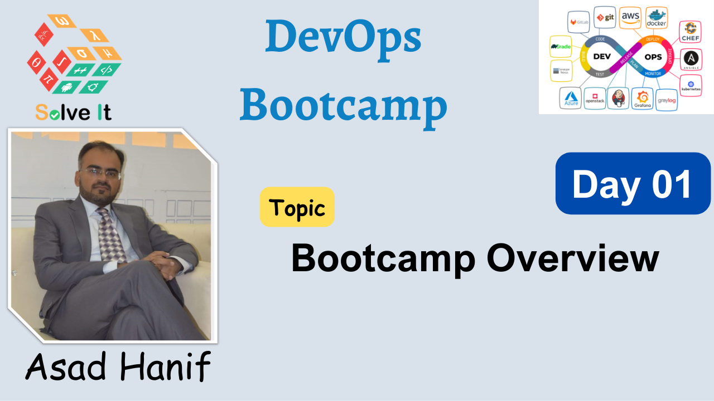
</a>

**Part B - Questions & Answers**

## Day 02
**Part A - Development and Operations**

<a href="https://youtu.be/3zyAWM7b21A" target="_blank">
  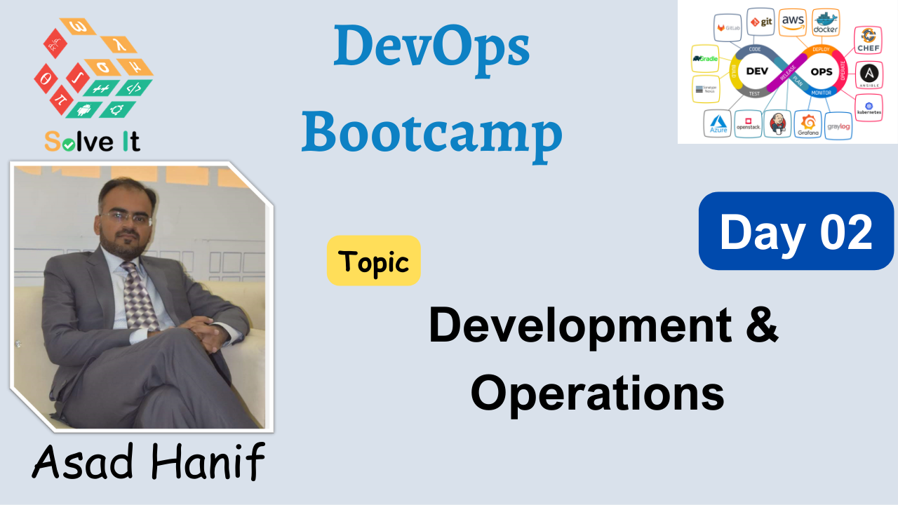
</a>

**Part B - Questions & Answers**

## Day 03
**Part A - Application Release Process**

**Part B - Questions & Answers**

<a href="https://youtu.be/-t-xd_FivyY" target="_blank">
  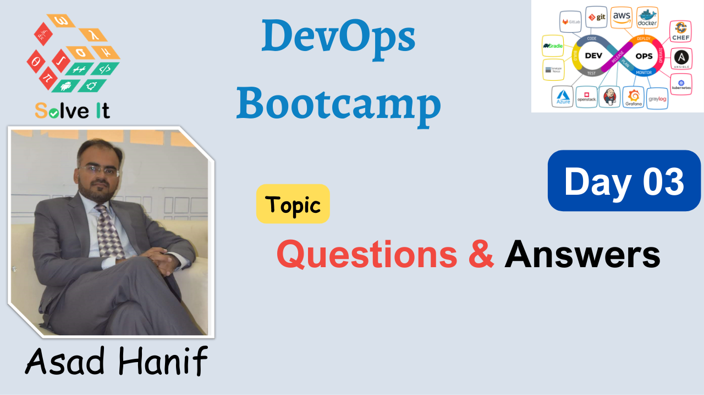
</a>

## Day 04
**Part A - Roadblocks of the Release Process**

<a href="https://youtu.be/-L_Y8cyoxKY" target="_blank">
  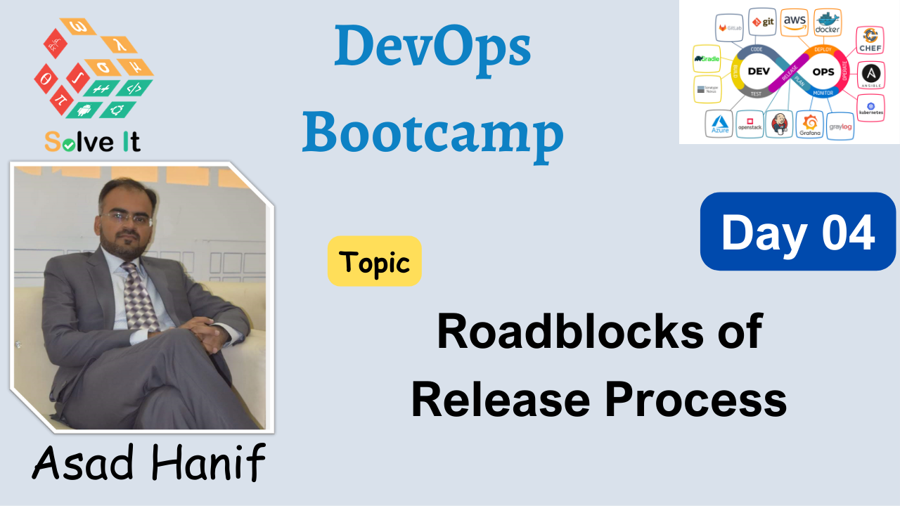
</a>

**Part B - Questions & Answers**

## Day 05
**Part A - Principles of DevOps and its Lifecycle**

**Part B - Questions & Answers**

## Day 06
**Part A - 7 Cs of DevOps**

<a href="https://youtu.be/E_VDKNQwta8" target="_blank">
  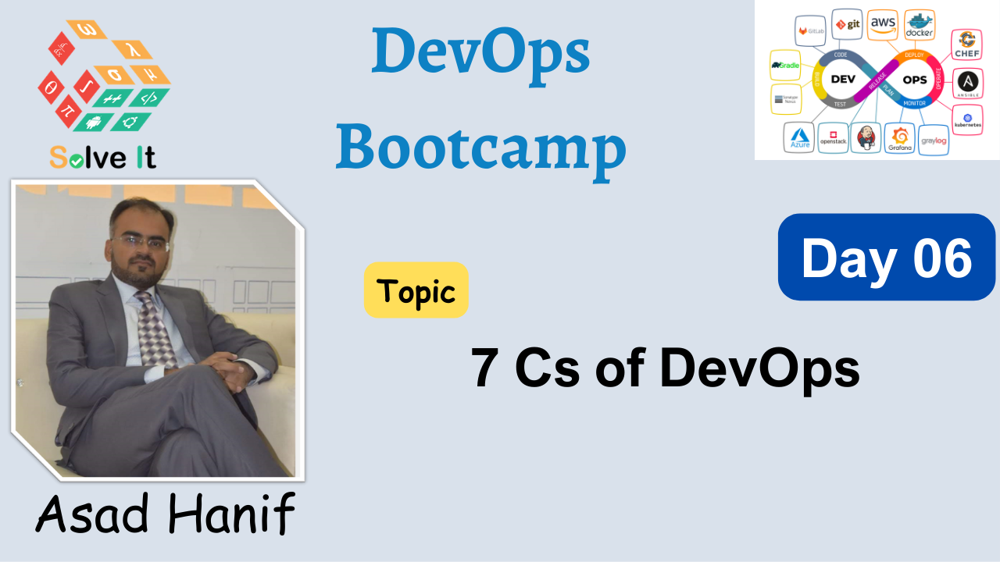
</a>

**Part B - Questions & Answers**

## Day 07
**Part A - Operating System**

**Part B - Questions & Answers**

## Day 08
**Part A - Virtualization**

<a href="https://youtu.be/1kKaQx23JNI" target="_blank">
  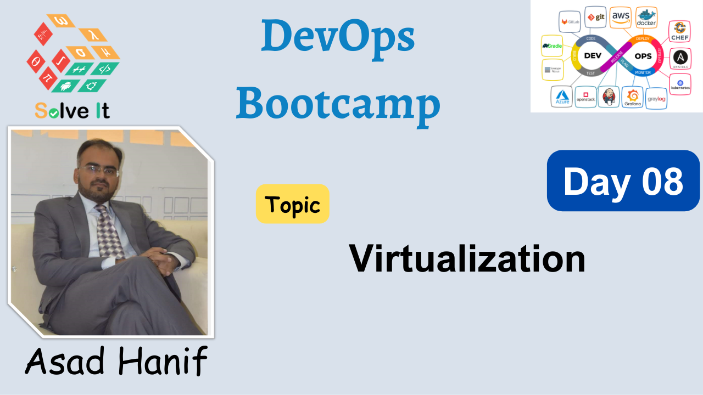
</a>

**Part B - Questions & Answers**

## Day 09
**Part A - Virtual Machine Setup on VirtualBox**

<a href="https://youtu.be/Z_gpemoJ8rI" target="_blank">
  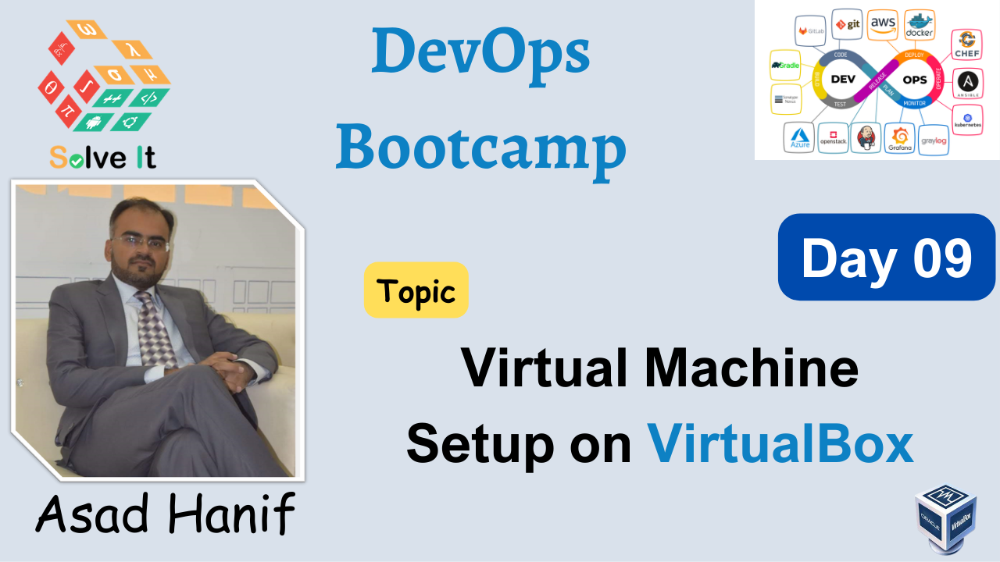
</a>

**Part B - Virtual Machine Setup on AWS**

<a href="https://youtu.be/UnKqhBM6ew4" target="_blank">
  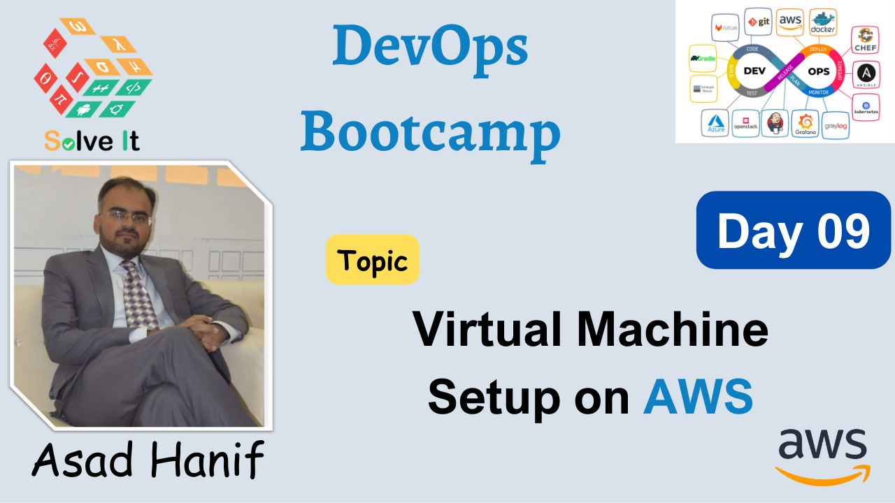
</a>

**Part C - Questions & Answers**

## Day 10
**Part A - Basic Utilities and Commands for Linux**

<a href="https://youtu.be/NINIlRxiEYo" target="_blank">
  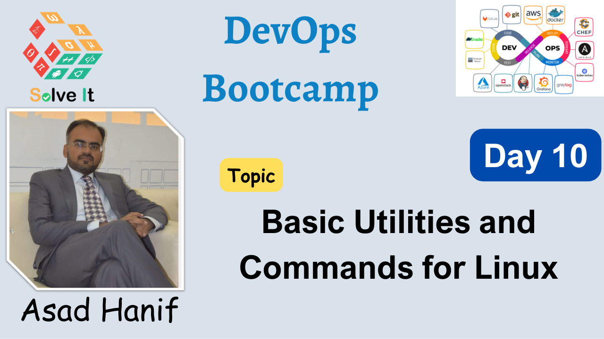
</a>

**Part B - Questions & Answers**

## Day 11
**Part A - Working with Directories in Linux**

<a href="https://youtu.be/74TmPGostFI" target="_blank">
  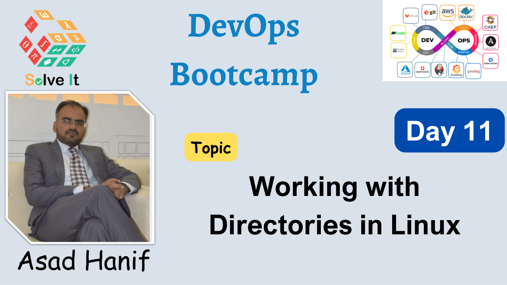
</a>

**Part B - Questions & Answers**

## Day 12
**Part A - Working with Text Files in Linux (Basic Commands)**

<a href="https://youtu.be/2m3q_0ZL2P4" target="_blank">
  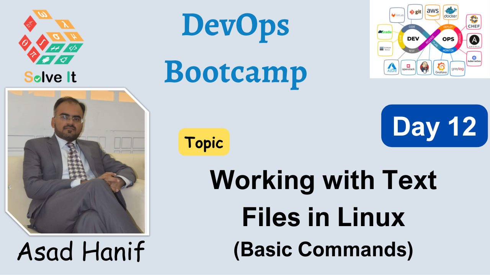
</a>

**Part B - Questions & Answers**

## Day 13
**Part A - Working with Text Files in Linux (Advanced Commands)**

<a href="https://youtu.be/lgUM2aQl_EA" target="_blank">
  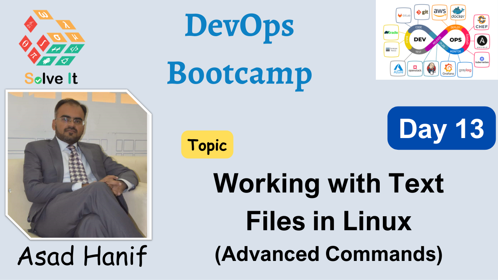
</a>

**Part B - Questions & Answers**

## Day 14
**Part A - Redirection and Pipes**

**Part B - Questions & Answers**

## Day 15
**Part A - Exploring the Nano Text Editor in Linux**

**Part B - Questions & Answers**

## Day 16
**Part A - Exploring the Vi Text Editor in Linux**

<a href="https://youtu.be/232KtEvalvw" target="_blank">
  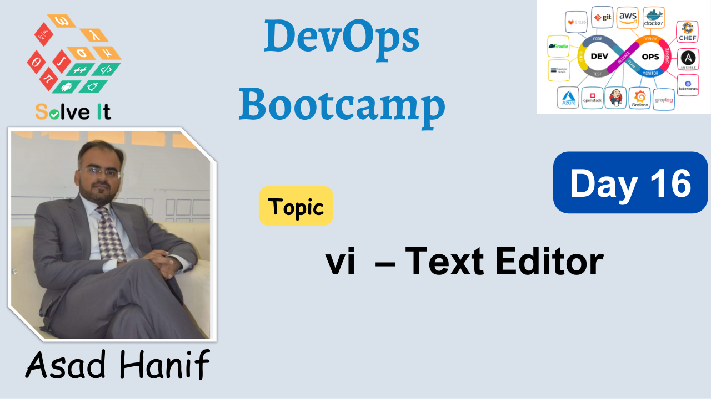
</a>

**Part B - Questions & Answers**

## Day 17
**Part A - File Compression and Archiving in Linux**

<a href="https://youtu.be/SEYfRuSkP-8" target="_blank">
  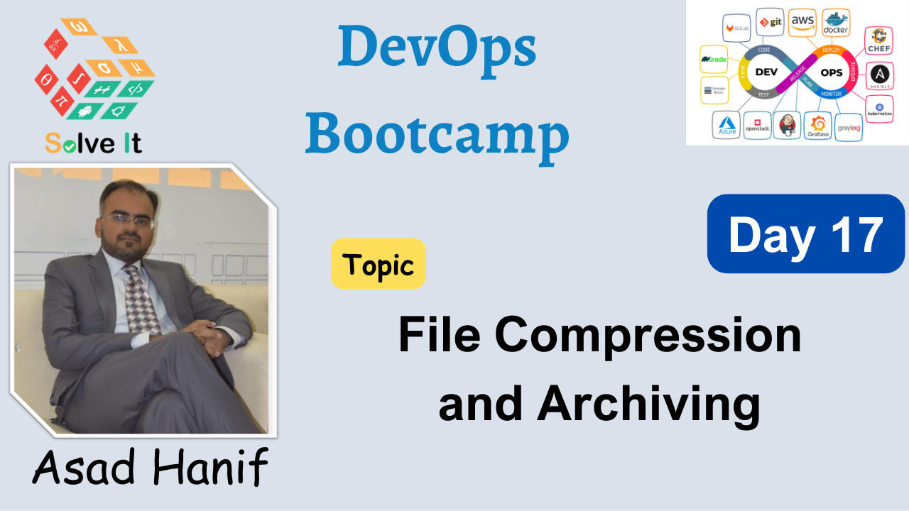
</a>

**Part B - Questions & Answers**

## Day 18
**Part A - Users and Groups Management in Linux**

**Part B - Questions & Answers**

## Day 19
**Part A - User Configuration Files**

**Part B - Questions & Answers**

<a href="https://youtu.be/ZLeUIPEmfpo" target="_blank">
  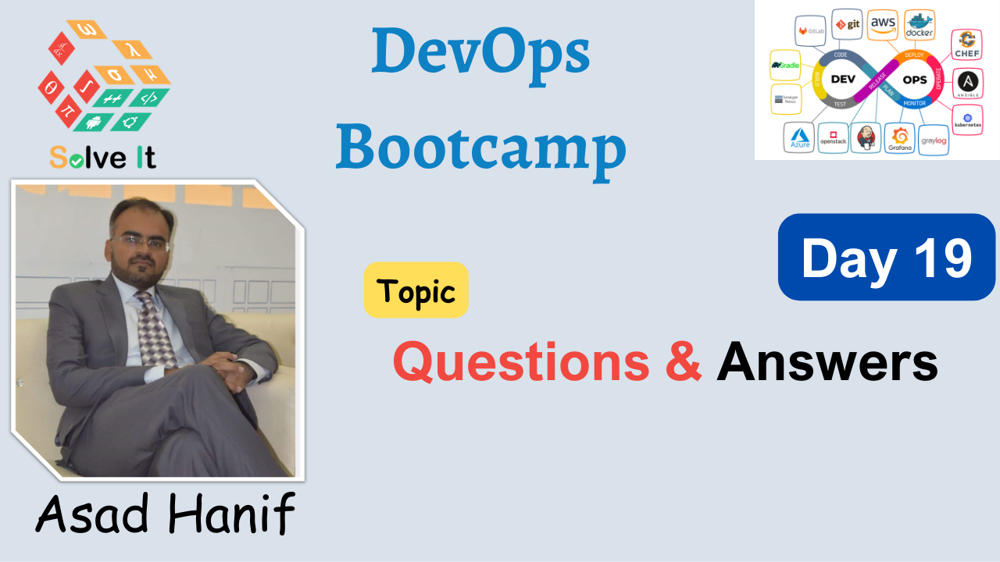
</a>

<!-- 
## Day 10
**Part A - **

**Part B - Questions & Answers**

 -->

[Go up](#welcome-to-the-devops-bootcamp)