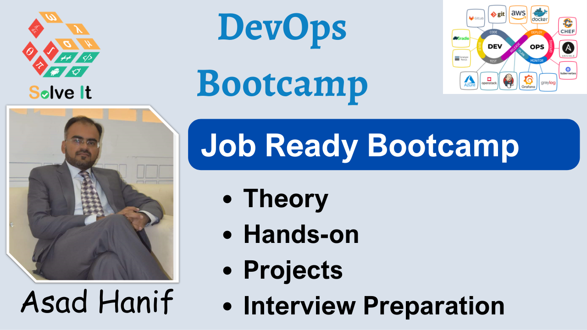

# DevOps Bootcamp - by Asad Hanif

## Welcome to the DevOps Bootcamp!

We are thrilled to welcome you to the **DevOps Bootcamp**! Congratulations on taking this important step towards advancing your skills and knowledge in the exciting field of DevOps. We are excited to have you on board.

## Meet the Instructor 

🧑‍🏫 We are thrilled to introduce our instructor for the *DevOps Bootcamp*, **Asad Hanif**! With a wealth of experiance in the field of DevOps and a passion for teaching, Asad is dedicated to guiding you through an enriching learning journey.

📚 Asad brings an industry expertise, having worked extensively in the field of DevOps and cloud engineering. With his deep understanding of tools and technologies like Kubernetes, OpenShift, Docker, AWS, and more, he is well-equipped to provide valuable insights and practical guidance.

🧑‍🏫 Connect with Asad on LinkedIn and other social media platforms to gain access to get in touch. Follow the links below to connect with him:

- [LinkedIn Profile](https://www.linkedin.com/in/asadhanif3188/)
- [GitLab Profile](https://gitlab.com/asadhanif3188)
- [GitHub Profile](https://github.com/asadhanif3188)
- Please feel free to reach out at [asadhanif3188@gmail.com](asadhanif3188@gmail.com). 

